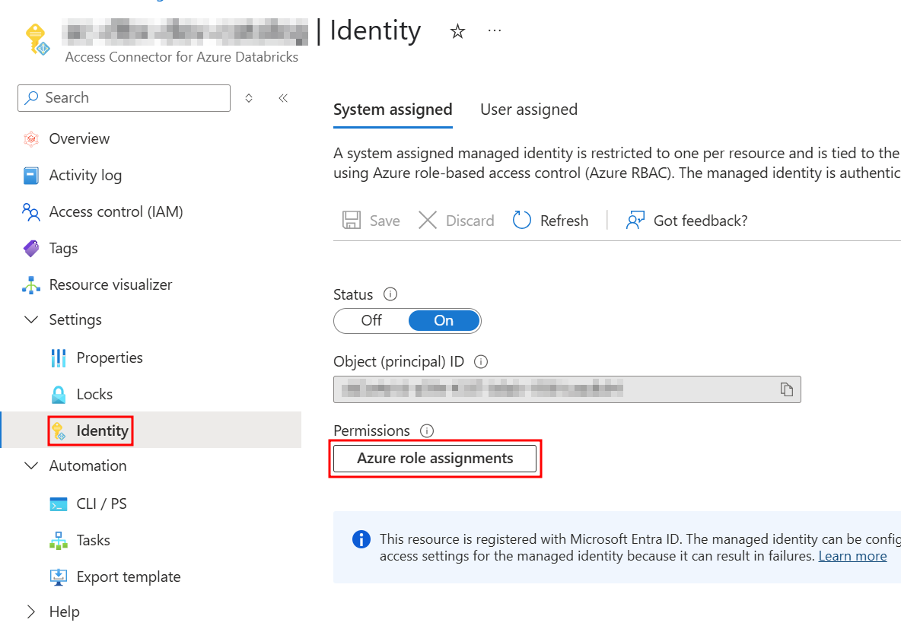
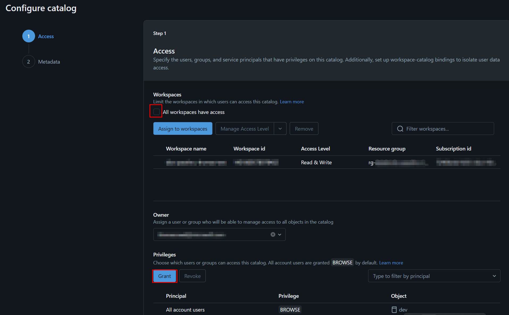
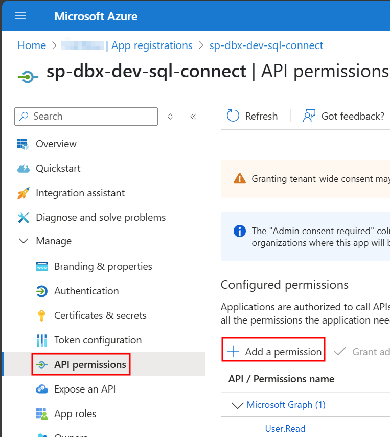
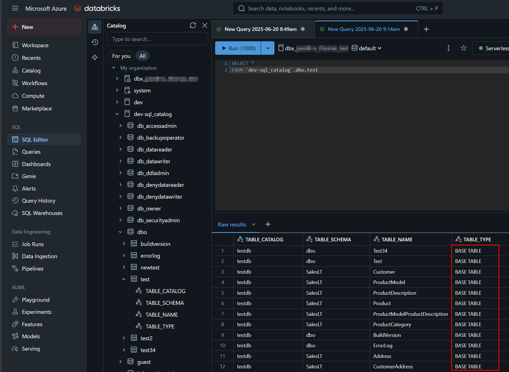
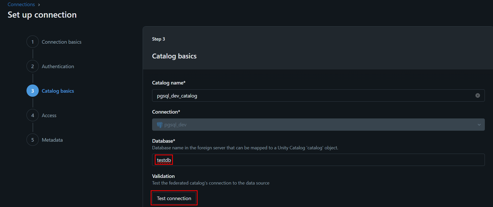
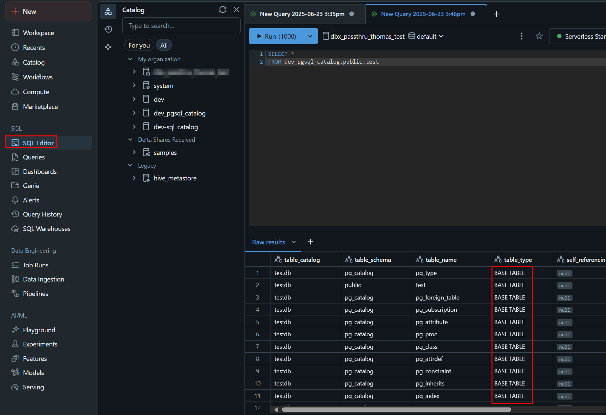
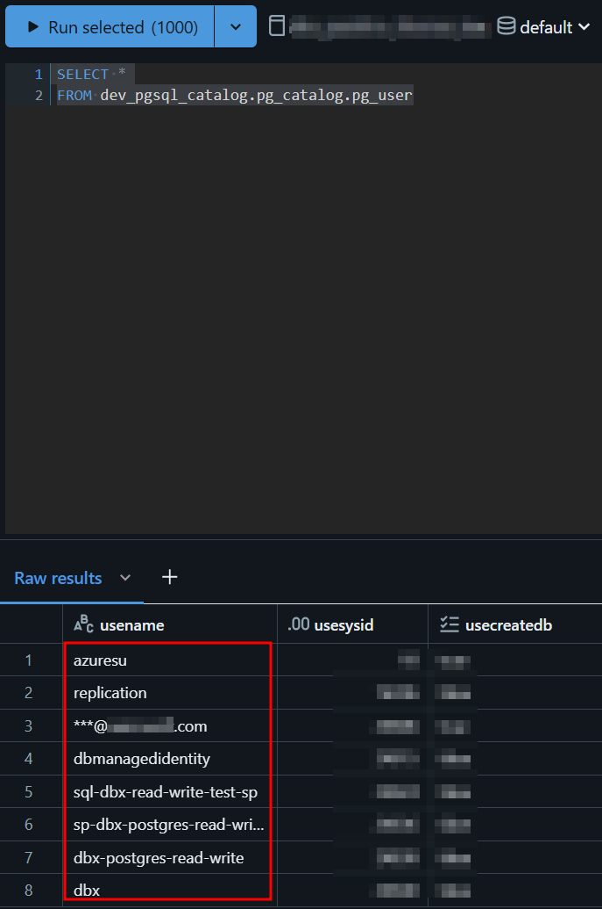

# How can I read and write to a database from an Azure Databricks notebook using Unity Catalog permissions?
In this demo, we will look at how to read and write to an Azure SQL Database and an Azure Postgres Flexible Server from a Unity Catalog-enabled Databricks workspace.  As we set up our solution, we will also apply some best practices for implementing data isolation in your Databricks environments, such as:
- mapping environment-specific Entra groups with [Automatic Identity Management](https://learn.microsoft.com/en-us/azure/databricks/admin/users-groups/automatic-identity-management)
- dedicated [access connectors](https://learn.microsoft.com/en-us/azure/databricks/connect/unity-catalog/cloud-storage/azure-managed-identities#config-managed-id) for each catalog
- dedicated catalog storage accounts
- [workspace binding](https://learn.microsoft.com/en-us/azure/databricks/admin/users-groups/automatic-identity-management) for catalogs, storage credentials, external locations


See the official Azure Databricks documentation for more [Unity Catalog best practices](https://learn.microsoft.com/en-us/azure/databricks/data-governance/unity-catalog/best-practices)

# Solution
- [Prerequisites](#prerequisites)
- [Azure SQL DB](#azure-sql-db)
- [Azure Postgres](#azure-postgres)

## Prerequisites
### Databricks Workspace with Unity Catalog
First, we will need to create a Databricks workspace with [Unity Catalog](https://learn.microsoft.com/en-us/azure/databricks/data-governance/unity-catalog/).  Unity Catalog is now [enabled automatically](https://learn.microsoft.com/en-us/azure/databricks/data-governance/unity-catalog/get-started#automatic-enablement-of-unity-catalog) at the Azure tenant level for new workspaces.

### Enable Automatic Identity Management
Next, navigate to your [Databricks account admin console](https://accounts.azuredatabricks.net/).  You will need to be an [account administrator](https://learn.microsoft.com/en-us/azure/databricks/admin/#account-admins) for this step.  On the Previews blade, enable automatic identity management.  This will automatically make Entra groups available in your Databricks workspace for granting permissions.


### Create developers group in Entra
Now open Entra Id in the Azure portal.  On the Overview blade, click '+ Add' and then 'Group'. Create a new group called dbx-developers.  Add any developers who should have access to your dev environment as members.


### Add the developers group to the workspace
The dbx-developers group has been automatically added to your Databricks account but not to your workspace yet.  Navigate to your Databricks workspace.  Click on your name in the upper right corner of the screen and then settings.  


In the workspace settings under identity and access, open manage groups.  


Start typing dbx-developers in the Group field.  Select it from the dropdown below and click Add. This will allow us to grant the group permissions in any of the catalogs inside the workspace.


### Create a data lake to store your Unity Catalog data
Create a storage account with hierarchical namespace enabled.  Open the Access Control (IAM) blade in the left menu and grant yourself the storage blob data contributor role.  Then click on the storage browser blade.  Create a new blob container.  Add a folder inside it to hold your unity catalog data.


### Create a Databricks Access Connector
Create a [Databricks Access Connector](https://learn.microsoft.com/en-us/azure/databricks/connect/unity-catalog/cloud-storage/azure-managed-identities#config-managed-id) in the Azure Portal.  Enable System Assigned Managed Identity. 


On the Identity blade of the connector, click on Azure role assignments and assign the connector the storage blob data contributor role on the data lake we just created.


### Create a storage credential
Inside the Databricks workspace, open up the Catalog Explorer.  Add a new [storage credential](https://learn.microsoft.com/en-us/azure/databricks/connect/unity-catalog/cloud-storage/storage-credentials).  Enter a name for the credential and paste in the access connector's resource Id (which you can find on the Overview blade of the access connector). Since we'll be using the connector's system assigned managed identity, you can ignore the user assigned managed identity field.


On the workspaces tab, remove the tickmark from the All workspaces have access checkbox.  Assign just to this workspace to ensure data isolation.


### Create an external location
Next, create an [external location](https://learn.microsoft.com/en-us/azure/databricks/connect/unity-catalog/cloud-storage/external-locations) using the storage credential. Copy the Data Lake Storage url (dfs endpoint) from the Endpoints blade of the storage account we created earlier and paste into the URL field in the external location dialog. Modify the url to fit the format ```abfss://```container-name```@```dfs-endpoint-without-http-prefix```/```folder-name. Select the credential we just created from the dropdown.


You should now see the external location's overview tab.  You can use the button in the upper right corner to (re-)test the connection anytime.


On the workspaces tab, remove the 'All workspaces have access' checkmark.  Assign just to this workspace to ensure data isolation. 


### Create a new catalog
Create a new [catalog](https://learn.microsoft.com/en-us/azure/databricks/catalogs/) called dev using the external location we just created. 


Click on Configure catalog.


On the workspaces tab, remove the 'All workspaces' checkmark.  Assign just to this workspace to ensure data isolation. Grant 'All Privileges' to the dbx-developers group.



### Create a new notebook
Go back to your workspace and create a new notebook to test the environment.  


Connect the notebook to serverless compute in the Compute dropdown.


In the first cell, add the code below to load the nyc taxi data for the year 2018 into a dataframe.
``` python
# Download the expanded nyc taxi data set for 2018
wasbs_path = 'wasbs://nyctlc@azureopendatastorage.blob.core.windows.net/yellow'
df = spark.read.parquet(wasbs_path).filter("puYear = 2018")
```

Alternatively, you can use the abridged nyctaxi data set in the samples delta share catalog. Note: the samples data set has a different schema with fewer columns and rows than the one at the url above.
``` python
df = spark.read.table("samples.nyctaxi.trips")
```

Now, let's write the data to our dev catalog as a managed table.
``` python
df.write.mode("overwrite").saveAsTable("dev.default.yellow_taxi")
```

Finally, display the table data to confirm that the data was written.
``` python
display(spark.read.table("dev.default.yellow_taxi"))
```


You can download the complete notebook [here](./databricks/DownloadTaxiDataUC.ipynb).

Now that we have our Unity Catalog managed tables working, let's have a look at reading and writing to databases next.

## Azure SQL DB
### Create an app registration in Entra Id
First, we will need a [service principal to connect to the database](https://learn.microsoft.com/en-us/azure/databricks/query-federation/sql-server#optional-register-an-app-in-microsoft-entra-id-for-azure-databricks).  Open Entra Id and click App registrations in the left menu under Manage.
Choose '+ New registration' from the menu bar at the top. Set the redirect URL to ```https://```dbx-workspace-url```/login/oauth/azure.html```


On the overview blade under Essentials, make a note of the client id and tenant id.  You'll need these later when creating the database connection.
Click on 'Add a certificate or secret' next to 'Client credentials'.


Then click on '+ New client secret'


The secret value will pop up on the screen. Make sure you copy it before navigating away. It will [never be shown again](https://learn.microsoft.com/en-us/entra/identity-platform/how-to-add-credentials?tabs=client-secret).


The connection setup doesn't require a key vault but you may want to store client id, tenant id and secret value in a key vault for safe keeping in case you need to refer to them again in the future.


Go back to your app registration and open the api permissions blade.  Add a new api permission.


Click on the tab 'APIs my organization uses' and filter on 'azure sql'.


Check the box for user impersonation.


### Create a connection
Now go into your Databricks workspace and open the Catalog browser.  Click on the plus sign in top right corner and select [create a connection](https://learn.microsoft.com/en-us/azure/databricks/query-federation/sql-server#connection).


Give your connection a name and select SQL Server for the connection type.  Select OAuth for the authentication type. Click Next at the bottom.


On the authentication dialog, you will need to enter the following:
- host: the full Azure SQL Server name including the 'database.windows.net' suffix 
- client secret: this was the secret value that we generated for the service principal and you hopefully copied somewhere 
- client id: copy this from the Essentials section of the overview blade for the service principal
- OAuth scope: ```https://database.windows.net/.default offline_access``` (copy as is into the field)
- Authorization endpoint: ```https://login.microsoftonline.com/```tenant-id```/oauth2/v2.0/authorize``` Add your Azure tenant id and copy into the field.  Your can find your tenant id in the Essentials section on the service principal's overview blade


When you're finished entering all the details, hit 'Sign in with Azure Entra Id'. You'll authenticate to Azure with your credentials and confirm the permissions to be granted.  You should see 'Successfully authorized' at the bottom of the dialog. Hit Next to continue.


Note: OAuth authentication for SQL connections supports User-to-Machine authentication, not Machine-To-Machine: 
- This means that your user credentials (as the person hit the 'Sign in with Azure Entra Id' button) will be used to connect to the SQL database from Databricks regardless of who is using the notebook. 
- The user_impersonation permission on the service principal allows it to act on behalf of a user who signed in during configuration, but Databricks does not dynamically impersonate the notebook user at runtime (that would require machine-to-machine OAuth authentication, which isn't supported at this time).

Next, in the connection details dialog, leave the 'Trust server certificate' checkbox unticked.  Select the application intent. Currently, only reading from a foreign catalog is supported, as we will see later.


In the Catalog basics dialog, select the database to mirror in the foreign catalog and give the catalog a name.  [Avoid characters that need to be escaped](https://learn.microsoft.com/en-us/azure/databricks/sql/language-manual/sql-ref-names) (like '-'). Otherwise, you'll need to use `` to escape the name when you reference it in a SQL query or [notebook](#create-a-notebook).


In the next screen, remove the tickmark from the 'All workspaces have access' checkbox to ensure data can only be accessed in this workspace.  Grant access to the dbx-developers Entra Id group that we created earlier.


Add any meta data tags you like and complete the setup.  Attach the serverless cluster and browse the new SQL catalog in the Catalog Explorer.  You should be able to see the schemas and tables contained in the database.


Click on a table and select the Sample Data tab at the top.  You should see several rows of data.


Now that we've verified that the connection is working, let's create a notebook and test reading and writing to the database there.

### Create a notebook
In the first cell, enter the code below. You can replace the table name with information_schema.tables if you don't have any data in your database yet. As you can see below, reading works out of the box without any authentication necessary inside the notebook.

``` python
df = spark.read.table("`dev-sql_catalog`.dbo.test")
display(df)
```


Let's try writing back to the database.  Enter the code below in another cell. This unfortunately fails as writing isn't supported yet but hopefully will be soon.
``` python
df.write.mode("overwrite").saveAsTable("`dev-sql_catalog`.dbo.test")
```


In the meantime, you can use a provisioned cluster with the [workspace managed identity](https://github.com/benijake/databricks-read-write-database-entra) or a [service principal](https://github.com/benijake/databricks-read-write-database-sp) to write.  Currently, serverless doesn't support managed identity at all and it only allows reading with a service principal.

You can download the complete notebook [here](./databricks/TestReadWriteSQLCatalog.ipynb).

### Row-level security
Row-level security is managed through Unity Catalog and not in the remote database. Open a SQL Editor and paste in the code below. Note: row filter functions cannot be saved in foreign catalogs so we have to save in our dev catalog instead.
``` SQL
CREATE FUNCTION IF NOT EXISTS dev.default.table_filter(TABLE_TYPE string)
RETURN IF (IS_ACCOUNT_GROUP_MEMBER('dbx-developer'), true, TABLE_TYPE = 'BASE TABLE');

ALTER TABLE `dev-sql_catalog`.dbo.test
SET ROW FILTER dev.default.table_filter on (TABLE_TYPE);
```


If we query the table again in a new window, we can see that only base tables appear in the result set.


The same is of course true for the notebook environment.


Opening the table in the catalog explorer, we can see on the overview tab that the filter has been applied in the row filter section at the bottom of the window.


Now only the filtered rows appear on the sample data tab.


### Column masking
Similarly, we can create column masks in Unity Catalog to hide sensitive data in the remote database. Start by creating a scalar UDF in the dev catalog and then alter the table column to use it as a masking function.
``` SQL
CREATE FUNCTION IF NOT EXISTS dev.default.email_mask(EmailAddress STRING)
RETURN (CASE WHEN is_account_group_member('dbx-developers') THEN CONCAT('***', SUBSTRING(EmailAddress, LOCATE('@', EmailAddress))) ELSE EmailAddress END);

ALTER TABLE `dev-sql_catalog`.saleslt.customer ALTER COLUMN EmailAddress SET MASK dev.default.email_mask;
```


If we query the table, we should now see redacted email addresses in the result set.


Opening the table in the catalog explorer, we can see on the overview tab that the filter has been applied to the EmailAddress column.


Switching to the sample data tab, we can see that the email addresses are redacted here too.


## Azure Postgres
### Create a local database user
Create a secret for the user in your keyvault.


Then navigate to your Azure Postgres server and connect to the postgres database. You can connect with VS Code using the button on the Overview blade or with Cloud Shell etc. on the Connect blade under Settings in the menu on the left.


In the **postgres** database, first create a new user using the secret we created above as the password and give it CONNECT privileges on your application database (called testdb in our example).
``` SQL
CREATE USER dbx WITH PASSWORD 'xxxxxxxxxxxxxxxxx';

GRANT CONNECT ON DATABASE testdb TO dbx;
```

Then connect to your **application database** and GRANT privileges to the user there.
``` SQL
ALTER DEFAULT PRIVILEGES IN SCHEMA public
GRANT SELECT, INSERT, UPDATE, DELETE ON TABLES TO dbx;

GRANT ALL PRIVILEGES ON SCHEMA public TO dbx;
```


### Make sure local authentication is enabled
If you're following Azure security best practice and normally enable only Entra authentication, remember to enable local authentication too. Unity Catalog only supports Basic Authentication (i.e. local database users) for Postgres currently.


### Create a connection
Now go into your Databricks workspace and open the Catalog browser.  Click on the plus sign in top right corner and select [create a connection](https://learn.microsoft.com/en-us/azure/databricks/query-federation/postgresql#connection).


Give your connection a name and select PostgreSQL for the connection type. Click Next at the bottom.


On the authentication dialog, you will need to enter the following:
- Host: the full Azure Postgres server name including the 'postgres.database.azure.com' suffix. You can find this on the Overview blade.
- User: name of the local database user, e.g. 'dbx'
- Password: paste in the secret we generated in the key vault earlier


In the Catalog basics dialog, select the database to mirror in the foreign catalog and give the catalog a name.  [Avoid characters that need to be escaped](https://learn.microsoft.com/en-us/azure/databricks/sql/language-manual/sql-ref-names) (like '-'). Otherwise, you'll need to use `` to escape the name when you reference it in a SQL query or notebook.


Test the connection.  If you get an error about an authentication token issue, most likely you're using an Entra service principal (app registration) instead of a local database user.  Unity Catalog connections to Postgres only support Basic Authentication at this time.


If you get an error about the IP address of your Databricks cluster not being able to connect to your Postgres database despite having the proper IP rules in place, double check the authentication settings of your Postgres server and ensure that 'PostgreSQL authentication' (local database authentication) is enabled.


In the next screen, remove the tickmark from the 'All workspaces have access' checkbox to ensure data can only be accessed in this workspace.  Grant access to the dbx-developers Entra Id group that we created earlier.


Add any meta data tags you like and complete the setup.  Attach the serverless cluster and browse the new Postgres catalog in the Catalog Explorer.  You should be able to see the schemas and tables contained in the database.


Click on a table and select the 'Sample Data' tab at the top.  You should see several rows of data.


Now that we've verified that the connection is working, let's create a notebook and test reading and writing to the database there.

### Create a notebook
In the first cell, enter the code below. You can replace the table name with information_schema.tables if you don't have any data in your database yet. As you can see below, reading works out of the box without any authentication necessary inside the notebook.

``` python
df = spark.read.table("dev_pgsql_catalog.public.test")
display(df)
```


Let's try writing back to the database.  Enter the code below in another cell. This unfortunately fails as writing isn't supported yet but hopefully will be soon.
``` python
df.write.mode("overwrite").saveAsTable("dev_pgsql_catalog.public.test")
```


In the meantime, you can use a provisioned cluster with the [workspace managed identity](https://github.com/benijake/databricks-read-write-database-entra) or a [service principal](https://github.com/benijake/databricks-read-write-database-sp) to write.  Currently, serverless doesn't support managed identity at all and it only allows reading with a service principal.

You can download the complete notebook [here](./databricks/TestReadWritePGSQLCatalog.ipynb).

### Row-level security
The process for implementing row-level security for a postgres foreign catalog is identical to what we did for SQL above.

Row-level security is managed through Unity Catalog and not in the remote database. Open a SQL Editor and paste in the code below. Note: row filter functions cannot be saved in foreign catalogs so we have to save in our dev catalog instead.
``` SQL
CREATE FUNCTION IF NOT EXISTS dev.default.table_filter(TABLE_TYPE string)
RETURN IF (IS_ACCOUNT_GROUP_MEMBER('dbx-developer'), true, TABLE_TYPE = 'BASE TABLE');

ALTER TABLE dev_pgsql_catalog.public.test
SET ROW FILTER dev.default.table_filter on (TABLE_TYPE);
```


If we query the table again in a new window, we can see that only base tables appear in the result set.


The same is of course true for the notebook environment.


Opening the table in the catalog explorer, we can see on the overview tab that the filter has been applied in the row filter section at the bottom of the window.


Now only the filtered rows appear on the sample data tab.


### Column masking
The process for implementing column masking for postgres foreign catalog is identical to what we did for SQL above.

We can create column masks in Unity Catalog to hide sensitive data in the remote database. Start by creating a scalar UDF in the dev catalog and then alter the table column to use it as a masking function.
``` SQL
CREATE FUNCTION IF NOT EXISTS dev.default.user_mask(usename STRING)
RETURN (CASE 
          WHEN is_account_group_member('dbx-developers') AND INSTR(usename, '@') > 0 THEN CONCAT('***', SUBSTRING(usename, LOCATE('@', usename))) 
          ELSE usename 
        END);

ALTER TABLE dev_pgsql_catalog.pg_catalog.pg_user ALTER COLUMN usename SET MASK dev.default.user_mask;
```


If we query the table, we should now see redacted email addresses in the result set.


Opening the table in the catalog explorer, we can see on the overview tab that the filter has been applied to the EmailAddress column.


Switching to the sample data tab, we can see that the email addresses are redacted here too.

